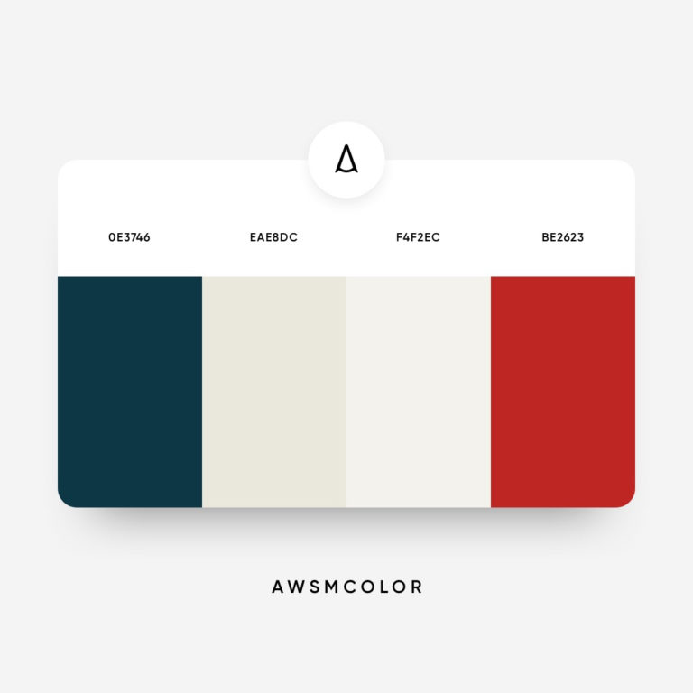

# Pop Goes The Weasel
## Code Institute Milestone Project 3: Python and Data Centric Development

Welcome
=======
Pop Goes The Weasel is a dictionary style website for users who want to learn more about cockney words, phrases and the art of rhyming slang.

A link to the website can be found [here](https://pop-weasel.herokuapp.com/)

### UX

#### Strategy
Pop Goes The Weasel is a fun and informative online dictionary for people of all ages. It is for users who may want to understand more about the language of cockney rhyming slang and/or contribute to the vernacular of terms. It is an interactive application where users can register then subsequently login to their account in order to add any further cockney words and phrases. The application is aimed at a wide range of users (10 - 100!) and because of that I am keeping the overall look contempory, yet professional. The users will want to access information regarding cockney words and phrases as well as contribute to the dictionary easily. 

As a first time user I want to:

* be able to read cockney words and rhyming slang phrases 
* be able to register for an account
* be able to add a word or phrase to the dictionary
* be able to edit a word or phrases in the dictionary that I have added
* be able to delete a word or phrase in the dictionary that I have added
* be able to instinctively navigate the website to find the information required efficiently.
* enjoy the experience of entering a website that is informative and understand the main aims of the site
* be able to contact the website for any further information about cockney rhyming slang or incase my account is malfunctioning.

As a registered user I want to:

* be able to log in and log out of my account
* be able to read cockney words and rhyming slang phrases 
* be able to add a word or phrase to the dictionary
* be able to edit a word or phrases in the dictionary that I have added
* be able to delete a word or phrase in the dictionary that I have added
* be able to instinctively navigate the website to find the information required efficiently.
* be able to contact the website for any further information about cockney rhyming slang or incase my account is malfunctioning.

As a site owner I want to:

* make the purpose of the site clear
* create an informative and interesting experience for users, whether registered or not
* present some cockney words/phrases in the dictionary but allow scope for more to be added
* allow registered users to create, read, edit and delete the dictionary
* allow users to read the dictionary

#### Scope
After analysis of the user stories, I have decided on the below features to be my initial minimum scope:

* Register account form
* Sign in form
* Sign out capability
* Add words to dictionary
* Edit words in dictionary 
* Delete words from dictionary
* Responsive design
* Contact form 

#### Structure

The application will be structured with traditional multiple pages from a navbar. 
Site structure will include the following pages.

For a new user:
* Home
* Register
* Sign In
* Contact 

For a registered user:
* Home 
* Profile
* Add To dictionary
* Sign Out

The project will also use a database served by the cloud platform MongoDB.

I set up the database using the following steps from CI tutorials:

* Created an account with MongoDB and selected the create a shared cluster option.
* Selected AWS as my cloud provider and my closest region.
* Then I selected The M0 cluster tier, named the cluster and created.
* Once the cluster was created I clicked on database access and added in the database user details.
* Then I set the database user privileges to read and write to the database.
* In security menu, network access, add IP address and access from anywhere.
* Clicked on the connect button then the connect your application button.
* Added the details into my environmental variable within env.py file to connect.
* Then within my cluster, I clicked collections, create database and named it 'Pop Goes The Weasel'.
* Within the database I created my 2 collections for the project - users and cockney_dictionary

##### Database schema 

My db consists of two collections: 

1. cockney_dictionary

    * Here is an example of a record from the collection:

            _id:6061e9439c533093c991e8ae

            word:"barnet"

            meaning:"hair"

            added_by:"ricky"

2. users 

    * Here is an example of a record from the collection:

            _id: 605c9a6865d28b2c50090bc2

            username: "andrew"
            
            password: "pbkdf2:sha256:150000$MaQNn5Lf$6bba13503c555e28773bcf1f25ac5d568c5080d3..."

#### Skeleton
I designed wireframes for mobile, tablet and desktop using Balsamiq.
They are viewable in PDF using the following link:

[Wireframes](static/images/PGTW_wireframes.pdf) 

#### Surface
##### Colours

I wanted the colours to reflect the UK flag, but in a more subtle and modern palette. This choice is to represent the cockneys of London, UK and their dialect.

#0E3746 - Navy Blue

#EAE8DC - Oatmeal

#F4F2EC - Off White

#BE2623 - Warm Red

Colour palette taken from www.digitalsynopsis.com 

##### Typography

I have used two Google Fonts: Roboto, Roboto Slab for headings and sans-serif as a back up font.

### Features

#### All Website Pages:
* A navbar with links ordered for a new user: home, contact, sign in, register; and for a registered user: home, contact, profile, add to dictionary, sign out. The navbar collapses into a hamburger button when viewed on smaller screen devices.
* A footer that includes links across the site, a tagline reiterating what the website is about and copyright information.
* The site is responsive on all devices with a mobile-first design making use of the Materialize framework.

#### Home Page:

* A home page with title, subtitle, hero image
* A 'How does it work' section to advise users how to use the site
* A feature circle image for interest
* The main cockney dictionary with two columns: words/phrases and corresponding meaning
* Cockney history section

#### Contact Form:
* A contact page with an easy to use form connected to EmailJS to allow anyone to contact the site owner

#### Sign In Page: 
* Sign In form with button for registered users
* Redirection link to register page if not registered at the bottom of the sign in form

#### Register Page:
* Register form with button for new users
* Redirection link to Sign In page if already registered

### Additional Features Once User Signed In

#### Add to dictionary Page:
* Form where user can type in word/phrase and meaning and button to submit to the dictionary

#### User Profile Page:
* User's name is displayed as the title
* Materialize collapsible featuring the words/phrases and meanings that the user has added themselves to the cockney dictionary
* Within collapsible feature there are two buttons: edit and delete
* When using edit button user is redirected to edit page
* When using delete button user sees delete modal confirmation step. The modal feature allows the user to view that they are about to delete that record and has a back button if they wish to change their mind, and a delete button if they do wish to continue deleting the record from the dictionary.

#### Edit Page:
* Edit dictionary form with word user has selected from their profile contribution collapsible to edit, populated within form
* Ability for user to delete populated form and edit/ change word and meaning as they wish
* Edit and Cancel buttons

#### Features Left to Implement:
* A search bar feature to look up words in the dictionary

### Technologies Used

* HTML5

* CSS3 

* Javascript

* Python

* Materialize

A modern framework used to implement css and layout features.

* MongoDB Atlas 

The cloud based service used as the database for the project.

* Flask

Uses Flask as a microframework to create the application.

* Heroku

A cloud platform used to deploy the project. 

* GitHub

The project uses GitHub to store its code.

* Gitpod

The project uses Gitpod as the IDE.

* Git

Used within Gitpod as the version control system.

* Google Developer Tools

Used within Google Chrome to inspect pages to help solve any bugs and view responsive design features.

* Balsamiq

The project uses Balsamiq to create wireframes.

* EmailJS

Used to integrate the functionality of the contact form to connect to an appropriate email address.

### Testing

Please refer to seperate document found [here](TESTING.md)

### Deployment

The repository for the project is held on GitHub and was created by Sarah Telesia. 

#### Steps to create project using Gitpod and GitHub:

* Navigate to Code Institute main template on github (https://github.com/Code-Institute-Org/gitpod-full-template)
* Click on 'Use this template' and create personalised Repository Name
* Click 'Create repository from template'
* Click on 'Gitpod' button in new respository, to open in IDE

#### Steps on how to clone the repository from GitHub

I have learned and taken the information for the below clone steps from https://docs.github.com/en/github/creating-cloning-and-archiving-repositories/cloning-a-repository

There are two options:

Clone using GitHub Desktop

Open GitHub website and navigate to Quartet-Militaire repository on Sarah Telesia's GitHub at: https://github.com/Telesia/pop_goes_the_weasel
Above the list of files, click on Code button
Scroll down to read 'Open with GitHub Desktop' and then click
This will open GitHub Desktop (If this is your first time using GitHub Desktop follow the software download procedure)
A pop up will ask you where you wish to clone the repository to on your local computer and then press clone
You can now access the repository files in your chosen IDE

Clone using Git

Open GitHub website and navigate to repository on Sarah Telesia's GitHub at: https://github.com/Telesia/pop_goes_the_weasel
Above the list of files, click on Code button           
Click on the web URL viewable and copy                        
Open the terminal
Change the current working directory to the location where you want the cloned directory
Type git clone, and then paste the URL you copied earlier
Press Enter to create your local clone.
You can now access the repository files in your chosen IDE

#### Deploy the Project to Heroku

Heroku is a cloud platform service where the project is hosted. 
https://www.heroku.com

The steps are show in the CI tutorial 'Putting the Basics In Place' which I followed and will set out below:

* Create a requirements.txt file in my IDE using the following command:
    pip3 freeze --local > requirements.txt

* Create a Procfile by using the following command:
    echo web: python app.py > Procfile

* Got to heroku website, create an account and sign in
* Click 'new' and 'create new app' in dashboard
* Choose a unique project name and select Europe as region and click 'create app'
* Once created we want to connect the heroku app to our github project where our code is hosted
* Find the unique github repository and click 'connect'
* Go to 'settings' tab, within heroku still, and click 'Reveal Config Vars'
* Add in your Key:Value pairs from your project code
* Check that your Procfile and requirements.txt have been pushed to your github repo as Heroku requires these
* Now click on 'Deploy Branch' so that Heroku can build and deploy your app

### Credits

Colour palette from www.digitalsynopsis.com 

I have recycled my contact form code from my MS2 project 

Credit to CI (Code Institute) lessons on EmailJS integration for the contact.js function.

Credit to CI (Code Institute) lessons on the Task Manager Application, which I have based my project around.

Credit to: Ed B_lead for code logic and how to wire up data-targets/Ids taken from Code Institute Slack channel.

Thanks to my mentor Spencer Barriball

