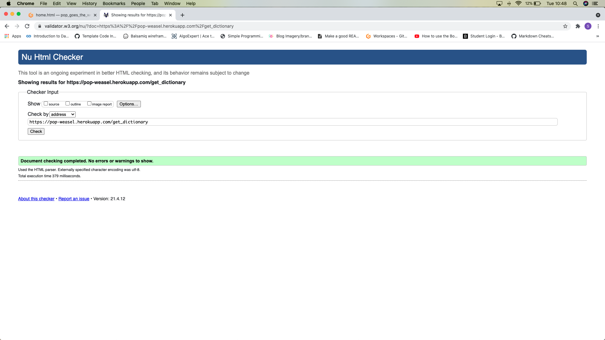
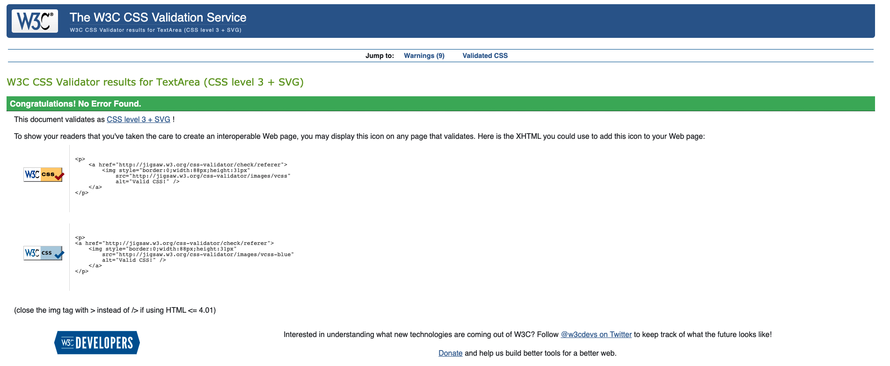

### Google Developer Tools

I used Google Chrome Developer Tools throughout the project. It was an invaluable resource to check how HTML and CSS changes would look. It was a particularly useful tool to have when checking for responsiveness on difference sized devices. 

I used the Lighthouse tool to check over my website. I went through each page sequentially in the browser and made a note of any issues to resolve (see table below). Overall, on first tests the site performed well and most were green, but there were a few adjustments to improve the site. 

| Page       | Lighthouse Improvement | Action | Adjusted |
| -----------|:-------------| :-------------|-------------:|
| home.html | Add meta data  |  Write meta data in head | Yes |
| home.html | Make sure H1-6 are in sequential order | Made sure no gaps in order of headings | Yes |
| contact.html | Make sure H1-6 are in sequential order | Made sure no gaps in order of headings | Yes |
| contact.html | Improve contrast of text on form | Add white background to form | Yes |
| profile.html | Make sure H1-6 are in sequential order | Made sure no gaps in order of headings |Yes |
| add_cockney.html | Make sure H1-6 are in sequential order | Made sure no gaps in order of headings | Yes |

The final report for the home page can be viewed below and [here](static/testing/testing_lighthouse_pgtw.png)

 

### W3C Validator HTML & CSS Testing

I used the W3C validators for HTML and CSS to check my code. 
All pages passed the checks after some adjustments to code. The main issue was in my semantic mark up of the pages. I had used main more than once and some sections did not have headings. This was rectified and here is an example below:

 

 

### Defensive Programming after initial tests

After a mentoring session where we tested through some of the features, I was advised to add in some defensive programming to secure my site better.
This meant that on the Log In page I added an extra layer of code so that a user needed to be "in session" to be able to access
the add to dictionary page. Otherwise, any user could retype the URL link themselves and access the add_cockney.html page.

### Feature Testing

| Page       | Action Taken  | Expected Result  | Pass/Fail | 
| -----------|:-------------| :----------------| ---------:|
| home.html | Click on all links in navbar |   Link to each page works correctly and loads   |    Passed    |
| home.html | Click on Sign Out in navbar  |   User signed out & return Sing In page | Passed
| home.html | Use Google Developer Tools to check different screen sizes to view hamburger icon navbar |   See the three dot navbar icon on smaller devices (under 992px) | Passed |
| home.html (992px and under) | Click on hamburger button | Opens up the navbar list items | Passed
| home.html (992px and under) | Click on each nav item within hamburger button | Link to each page works correctly and loads | Passed |
| home.html (992px and under) | Click on each nav item within hamburger button | Link to each page works correctly and loads | Passed |
| register.html | Add new username and password | registers user and redirects to blank register form | Passed
| register.html | Click 'Sign in here' link below form| Opens sign in page | Passed |
| sign_in.html | Enter username and password and click sign in | Takes user to their profile page | Passed |
| sign_in.html | Click Register here link below form | Opens register page | Passed |
| add_cockney.html | Form for user to enter word and meaning and click add to dictionary button | Passed |
| user_profile.html | Word added previously, click edit button on accordian | Open edit_cockney.html | Passed |
| edit_cockney.html | Word and meaning preloaded to Edit form | | Passed |
| edit_cockney.html | Edit word and meaning and click edit button | Changes dictionary entry and reloads edit cockney form and can see adjustment | Passed |
| edit_cockney.html | Edit word and meaning on form but change mind so click cancel button | removes edits made and reverts back to original entry | Passed |
| user_profile.html | Click delete button | Delete confirmation modal shows | Passed |
| user_profile.html | Click back button in modal | Return to profile page with accordian of dictionary entries for user | Passed |
| user_profile.html | Click delete button in modal | Deletes dictionary entry, flash message 'Task Deleted' shows & return to Add to Dictionary form | Passed |

#### Bug Testing

| Bugs Found | Action to fix | Link to fix commit| 
| -----------|:-------------:| -----------------:| 
| Contact page not working | Remove type attribute and check through all code for errors, add space between end blocks | https://github.com/Telesia/pop_goes_the_weasel/commit/02d01b957ee40e0f7080a2c3930c16fe7fef785d |
| When testing the user profile and Add Cockney pages through the validator, getting a 500 remote server? 

