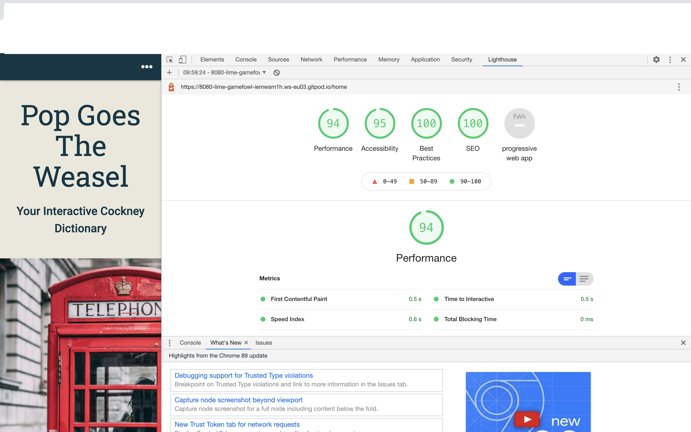

#### Google Developer Tools

I used Google Chrome Developer Tools throughout the project. It was an invaluable resource to check how HTML and CSS changes would look. It was a particularly useful tool to have when checking for responsiveness on difference sized devices. In particular, when checking the embedded YouTube video worked on smaller screen devices in horizontal view. The video is best viewed in horizontal mode on tablet and mobile devices. Another way the Developer Tools were useful was for viewing the Bootstrap navbar, cards and contact form. I had used the Bootstrap responsive classes in order to make sure they filled the screen on smaller devices. I am happy with the mobile first design of the website and the way it looks clear and easy to read on a mobile sized device. With current trends in how users are viewing websites a mobile first design and good user experience on small devices is crucial. The website also lends itself to tablet sized devices. The only criticism for viewing on a tablet sized device is that the Contact page and Media page have some dead space that could be utilised.

When I first viewed my Contact page using the Developer Tools in Chrome, I noticed that the heading and subheading for the page pushed the contact form lower down on smaller device sizes. This meant that the user experience would be hindered and visually it was not appealing. I decided to use media queries to hide the subheading for smaller devices to eliminate this visual issue.

I used the Lighthouse tool to check over my website. I went through each page sequentially in the browser and made a note of any issues to resolve (see table below). Overall, on first tests the site performed well and most were green, but there were a few adjustments to improve the site. 

| Page       | Lighthouse Improvement | Adjusted |
| -----------|:-------------:| 
| home.html | Add meta data in head |   Yes |
| home.html | Make sure H1-6 are in sequential order |  Yes |
| contact.html | Make sure H1-6 are in sequential order | Yes |
| profile.html | Make sure H1-6 are in sequential order | Yes |
| add_cockney.html | Make sure H1-6 are in sequential order | Yes |

The report for the home page can be viewed below and [here](static/testing/testing_lighthouse_pgtw.png)

 

#### Defensive Programming after initial tests

After a mentoring session where we tested through some of the features, I was advised to add in some defensive programming to secure my site better.
This meant that on the Log In page I added an extra layer of code so that a user needed to be "in session" to be able to access
the add to dictionary page. Otherwise, any user could retype the URL link themselves and access the add_cockney.html page.

Please refer to seperate document found [here](TESTING.md)

* Noticed bug with mobile view that navbar  link for brand-logo didn't display fully so adjusted design to use an icon which mixed up the media and worked better visually 
for responsiveness.

  if request == "POST":
        word = {
            "word": request.form.get("word"),
            "meaning": request.form.get("meaning"),
            "added_by": session["user"]
            }
        mongo.db.cockney_dictionary.insert_one(word)

* bug in display of dictionary showing first line the wrong way round for word and meaning. The html h5 tag I had added had made it display incorrectly.
